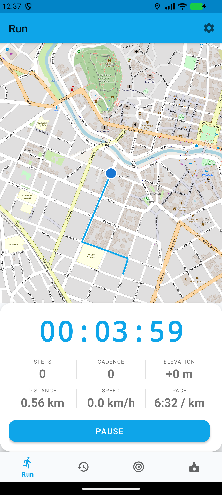
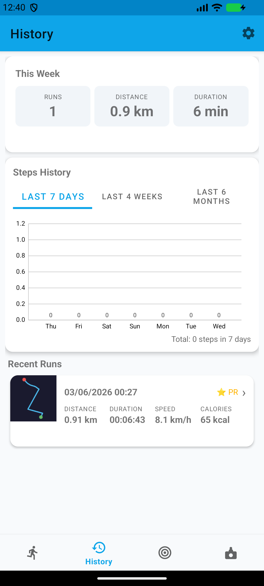
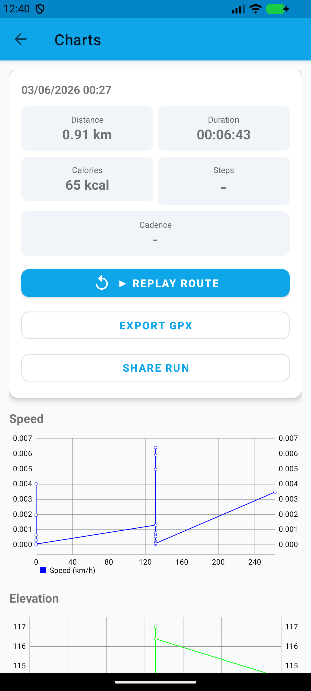
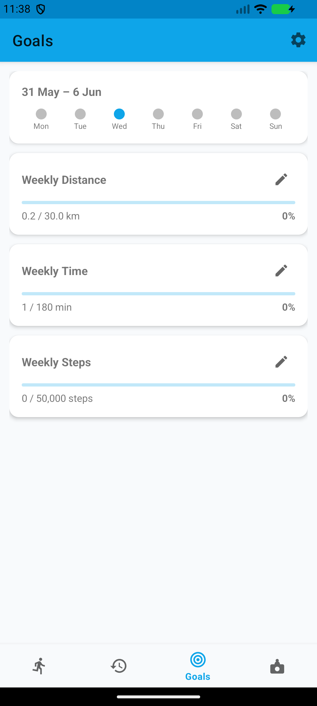
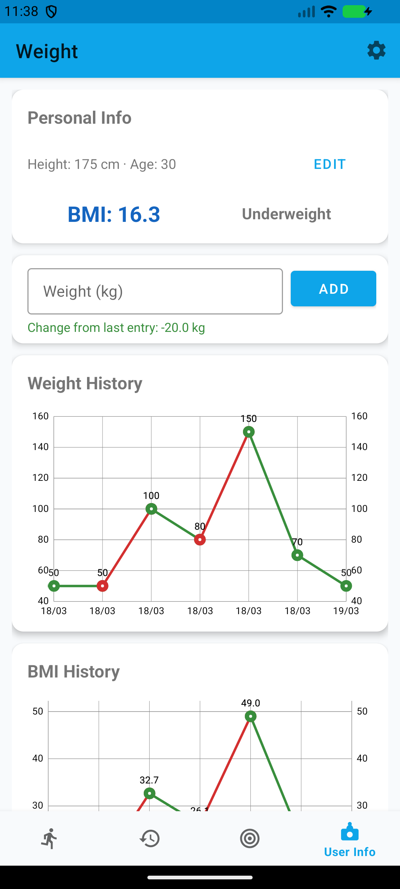
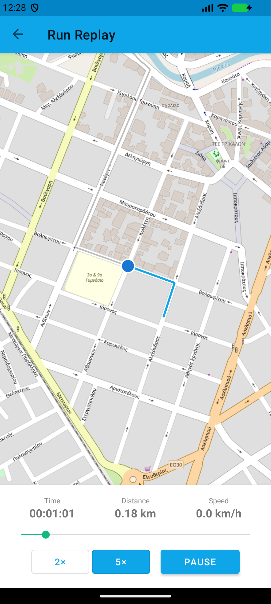

<div align="center">

# 🏃 FitnessUltra

**Μια ολοκληρωμένη, offline-first εφαρμογή καταγραφής τρεξίματος για Android, γραμμένη σε Kotlin.**

Κατέγραψε τρεξίματα με GPS, παρακολούθησε βάρος & BMI, κάνε replay παλιές διαδρομές και δες αναλυτικά στατιστικά ανά run — **χωρίς cloud, χωρίς λογαριασμούς και χωρίς API keys**.


[English](README.md) · **Ελληνικά**

</div>

---

## 🛜 Λειτουργεί πλήρως offline

Το FitnessUltra **δεν χρειάζεται internet για να καταγράψει ένα run**. GPS, χρονόμετρο, αισθητήρες, υπολογισμοί θερμίδων/υψομέτρου και όλα τα δεδομένα σου είναι 100% στη συσκευή (βάση Room). **Κατέβασε πλακίδια χάρτη** για μια περιοχή από πριν και ο ζωντανός χάρτης συνεχίζει να σχεδιάζει τη διαδρομή σου ακόμη και με τα δεδομένα κλειστά — ιδανικό για μονοπάτια, βουνά ή για εξοικονόμηση μπαταρίας & data. Χωρίς Google Maps, χωρίς API key, χωρίς σύνδεση.

---

## 📥 Λήψη

Δύο τρόποι να αποκτήσεις την εφαρμογή:

| | Επιλογή | Πώς |
|---|---|---|
| 📦 | **Εγκατάσταση APK** | Κατέβασε το τελευταίο APK από τη **[σελίδα Releases](../../releases/latest)** και κάνε sideload (δες [Εγκατάσταση](#-εγκατάσταση)). |
| 🛠️ | **Build από τον κώδικα** | Άνοιξε το project στο **Android Studio** και πάτα **Run ▶** (δες [Εγκατάσταση](#-εγκατάσταση)). |

---

## 📸 Screenshots

> Δοκιμαστικά runs καταγεγραμμένα στα **Τρίκαλα** (Άι Γιώργης → Μύλος Ματσόπουλου), πάνω σε πραγματικούς δρόμους.

| Ζωντανή καταγραφή GPS | Ιστορικό & PRs | Γραφήματα ανά run |
|:---:|:---:|:---:|
|  |  |  |
| **Εβδομαδιαίοι Στόχοι** | **Βάρος & BMI** | **Replay Διαδρομής** |
|  |  |  |

---

## ✨ Πλήρης λίστα χαρακτηριστικών

### 🏃 Καταγραφή τρεξίματος
- Ζωντανή **καταγραφή GPS** σε χάρτη **OpenStreetMap** (χωρίς API key), με marker που κεντράρει αυτόματα και τη διαδρομή να σχεδιάζεται live
- Ζωντανά **απόσταση · ταχύτητα · pace · χρόνος · υψομετρική ανάβαση · cadence** (βήματα/λεπτό)
- **Μετρητής βημάτων υλικού** (`TYPE_STEP_COUNTER`, fallback `TYPE_STEP_DETECTOR`), με speed-gate ώστε να αγνοεί ψευδείς μετρήσεις σε στάση
- **Υπολογισμός θερμίδων** με τον τύπο di Prampero **+ κόστος υψομέτρου**
- **Φωνητική καθοδήγηση** — ανακοινώσεις σε ρυθμιζόμενα ορόσημα απόστασης, στη γλώσσα σου
- **Foreground service + WakeLock** — η καταγραφή συνεχίζεται με κλειστή οθόνη / app στο παρασκήνιο
- Ζωντανή **ειδοποίηση** (χρόνος / απόσταση / pace) με **Παύση · Συνέχεια · Τέλος**
- **Αντίστροφη μέτρηση 3-2-1** με beep πριν την εκκίνηση
- **Auto-pause** όταν σταματάς (< 1 km/h) και προαιρετικό **auto-resume** όταν ξεκινάς πάλι
- **Widget** αρχικής οθόνης με ζωντανό χρόνο, απόσταση και pace

### 🎯 Τύποι προπόνησης
| Τύπος | Περιγραφή |
|---|---|
| **Free Run** | Κανονικό τρέξιμο χωρίς καθοδήγηση |
| **Interval Training** | Εναλλαγή φάσεων τρέξιμο/περπάτημα — ρυθμιζόμενη διάρκεια & επαναλήψεις· TTS + beep σε κάθε αλλαγή· ο χρονιστής μετρά μόνο ενεργό (μη-σε-παύση) χρόνο |
| **Target Pace** | Όρισε στόχο ρυθμού· φωνητικές ειδοποιήσεις + χρωματικό feedback όταν πας πολύ γρήγορα/αργά |

### 📜 Ιστορικό
- Πλήρες ημερολόγιο runs με **swipe-to-delete + Undo** (επαναφέρει ολόκληρη διαδρομή, splits και thumbnail)
- **Thumbnails διαδρομής** — μικρογραφία χάρτη της κάθε διαδρομής
- **Σήματα Προσωπικού Ρεκόρ (⭐ PR)** — μεγαλύτερη απόσταση & ταχύτερο pace, αυτόματα
- Κάρτα **εβδομαδιαίας σύνοψης** με διαφορά από την προηγούμενη εβδομάδα
- **Ιστορικό βημάτων** (7 ημέρες / 4 εβδομάδες / 6 μήνες)

### 📊 Ανάλυση Run (Charts)
- Σύνοψη: απόσταση, διάρκεια, θερμίδες, βήματα, μέσο cadence, μέση ταχύτητα
- Γραφήματα **ταχύτητας**, **υψομέτρου** και **pace** στον χρόνο
- Πίνακας **split ανά χιλιόμετρο** με highlight στο καλύτερο
- **Εξαγωγή GPX** — μοιράσου `.gpx` συμβατό με Strava, Garmin Connect κ.ά.
- **Share run** — έτοιμη εικόνα σύνοψης (Instagram Stories ή οποιαδήποτε εφαρμογή)

### ▶️ Run Replay
- **Animation αναπαραγωγής** της διαδρομής σε ζωντανό χάρτη
- Ρυθμιζόμενη ταχύτητα: **1× / 2× / 5×**
- **Scrubber** — σύρε σε οποιαδήποτε στιγμή· η αναπαραγωγή σταματά κατά το scrubbing και συνεχίζει μετά
- Ζωντανά χρόνος, απόσταση και ταχύτητα καθώς σύρεις

### 🏆 Στόχοι
- Εβδομαδιαίοι στόχοι **απόσταση · χρόνος · βήματα**
- Μπάρες προόδου με χρωματικό feedback (γκρι → primary → πράσινο στο 100%)
- Σειρά με κουκκίδες ημερών που έδειξαν τις μέρες δραστηριότητας

### ⚖️ Βάρος & BMI
- Προσωπικά δεδομένα (ύψος, ηλικία) τοπικά
- **Ιστορικό βάρους** με χρωματικό γράφημα τάσης (kg ή lbs)
- Γράφημα **ιστορικού BMI** και **δείκτης BMI** — ημικυκλικό καντράν με ζώνες ΠΟΥ (Λιποβαρής / Φυσιολογικό / Υπέρβαρος / Παχύσαρκος)

### 🗺️ Offline χάρτες
- **Λήψη πλακιδίων** χάρτη για μια περιοχή ώστε η εφαρμογή να δουλεύει με **μηδέν internet**
- Επίπεδα λεπτομέρειας: Normal (zoom 10–14) · Detailed (10–16) · HD (10–17)
- Εκτίμηση πλακιδίων (πλήθος + MB) πριν τη λήψη
- Παράλληλη λήψη (8 συνδέσεις) με μπάρα προόδου
- Αποθηκευμένες περιοχές με όνομα, ημερομηνία, πλήθος· tap για προεπισκόπηση

### ⚙️ Ρυθμίσεις & εξατομίκευση
| Κατηγορία | Επιλογές |
|---|---|
| **Μονάδες** | Απόσταση km / μίλια · Βάρος kg / lbs · Φύλο (για θερμίδες) |
| **Run** | Ακρίβεια GPS · Auto-pause · Auto-resume · Keep screen on · Countdown |
| **Χάρτης** | Στυλ: Standard / CyclOSM / HOT · Auto-center στη θέση |
| **Φωνή** | Ενεργοποίηση · συχνότητα · γλώσσα (συσκευής / Αγγλικά / Ελληνικά / Ισπανικά / Γερμανικά) |
| **Εμφάνιση** | Θέμα: Συστήματος / Φωτεινό / Σκοτεινό · Γλώσσα **EN / EL / ES / DE** |
| **Offline χάρτες** | Λήψη, διαχείριση και προεπισκόπηση περιοχών |

---

## 🎯 Ακρίβεια αισθητήρων

| Αισθητήρας | Υλοποίηση |
|---|---|
| **GPS** | Updates 1 Hz, φίλτρο ακρίβειας ≤20 m, γρήγορο πρώτο fix, καταστολή jitter 1 m, teleport guard (>120 km/h απορρίπτεται) |
| **Ταχύτητα** | GPS Doppler, εξομάλυνση EMA (α=0.5) |
| **Απόσταση** | Συσσώρευση μόνο από fixes ≤20 m· πρώτο fix αποδεκτό στα ≤50 m για άμεση εμφάνιση |
| **Υψόμετρο** | Βαρόμετρο (`TYPE_PRESSURE`, ±1–2 m) όταν υπάρχει, EMA· fallback στο υψόμετρο GPS |
| **Βήματα** | Μετρητής υλικού με speed-gate (αγνοεί κάτω από 0.5 km/h), ενεργό μόνο μετά το πρώτο GPS fix |
| **Θερμίδες** | Τύπος di Prampero (1.036 / 0.945 kcal·kg⁻¹·km⁻¹) + κόστος υψομέτρου (0.009 kcal·kg⁻¹·m⁻¹) |

---

## 🛠️ Τεχνολογίες

| Επίπεδο | Βιβλιοθήκη / Εργαλείο |
|---|---|
| Γλώσσα | **Kotlin** |
| Αρχιτεκτονική | **MVVM**, Navigation Component, ViewBinding, Coroutines + Flow |
| Χάρτες | OSMDroid 6.1.18 (OpenStreetMap) |
| GPS | Fused Location Provider (play-services-location 21.2.0) |
| Αισθητήρες | `TYPE_STEP_COUNTER` / `TYPE_STEP_DETECTOR` / `TYPE_PRESSURE` |
| Βάση | **Room 2.6.1** (v3, χειρόγραφα migrations, exported schema) |
| Γραφήματα | MPAndroidChart 3.1.0 |
| Φωνή | Android TextToSpeech |
| UI | Material Components 1.11.0 |

### Αρχιτεκτονική με μια ματιά
```
com.fitnessultra
├── data/            Room DB (runs · location_points · weight_entries · run_splits) + repositories
├── service/         TrackingService — foreground GPS/timer/αισθητήρες, εκθέτει LiveData
├── ui/
│   ├── run/         Ζωντανή καταγραφή, τύποι προπόνησης, widget
│   ├── history/     Ημερολόγιο, PR badges, thumbnails, εβδομαδιαία σύνοψη
│   ├── charts/      Ανάλυση ανά run + εξαγωγή GPX
│   ├── replay/      Animation διαδρομής
│   ├── goals/       Εβδομαδιαίοι στόχοι
│   ├── weight/      Ημερολόγιο βάρους + δείκτης BMI
│   └── settings/    Ρυθμίσεις + διαχείριση offline χαρτών
└── util/            TrackingUtils · SettingsManager · GpxExporter · ThumbnailUtils
```

---

## 📲 Εγκατάσταση

### Επιλογή 1 — Κατέβασε το APK (χωρίς build tools)
1. Στο Android κινητό σου, άνοιξε τη **[σελίδα Releases](../../releases/latest)** και κατέβασε το `FitnessUltra-v1.0.apk`.
2. Άνοιξε το αρχείο. Αν ζητηθεί, επίτρεψε την **εγκατάσταση άγνωστων εφαρμογών**.
3. Πάτα **Εγκατάσταση → Άνοιγμα**.
4. Δώσε δικαιώματα **Τοποθεσίας**, **Φυσικής δραστηριότητας** και **Ειδοποιήσεων**, και πάτα **START**.

### Επιλογή 2 — Build & εκτέλεση από Android Studio
1. Κάνε clone το repo και άνοιξέ το στο **Android Studio** (Hedgehog ή νεότερο).
2. Άσε το Gradle να συγχρονιστεί & να κατεβάσει τα dependencies (δεν χρειάζονται API keys).
3. Σύνδεσε συσκευή ή ξεκίνα emulator (API 24+) και πάτα **Run ▶**.

<details>
<summary>Build από γραμμή εντολών</summary>

```bash
# Debug APK
./gradlew assembleDebug      # → app/build/outputs/apk/debug/app-debug.apk

# Εγκατάσταση σε συνδεδεμένη συσκευή / emulator
./gradlew installDebug
```
</details>

---

## 🗄️ Βάση δεδομένων

Room v3 — τέσσερις πίνακες: `runs`, `location_points` (FK→runs CASCADE), `weight_entries`, `run_splits` (FK→runs CASCADE).
Migrations: **1→2** προσθέτει `stepCount`· **2→3** δημιουργεί `run_splits` + index. Το schema εξάγεται στο `app/schemas/`.

---

## 🔒 Δικαιώματα

`ACCESS_FINE_LOCATION` · `ACCESS_COARSE_LOCATION` · `FOREGROUND_SERVICE` · `FOREGROUND_SERVICE_LOCATION` · `POST_NOTIFICATIONS` · `INTERNET` · `ACTIVITY_RECOGNITION` · `WAKE_LOCK`

> Το `INTERNET` χρησιμοποιείται μόνο για online πλακίδια χάρτη· με προ-κατεβασμένους offline χάρτες η εφαρμογή δουλεύει ουσιαστικά χωρίς αυτό.

---

## 🗺️ Roadmap

- [ ] Προαιρετικό cloud sync & leaderboards (Supabase)
- [ ] Wear OS companion
- [ ] Unit tests για `TrackingUtils` & Room migrations

---

## 📄 Άδεια

Διανέμεται υπό την [άδεια MIT](LICENSE).
