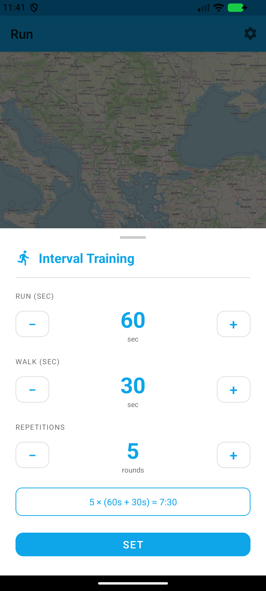

<div align="center">

# 🏃 FitnessUltra

**Μια ολοκληρωμένη, offline-first εφαρμογή καταγραφής τρεξίματος για Android, γραμμένη σε Kotlin.**

Κατέγραψε τρεξίματα με GPS, παρακολούθησε βάρος & BMI, κάνε replay παλιές διαδρομές και δες αναλυτικά στατιστικά ανά run — **χωρίς cloud και χωρίς API keys**.


[English](README.md) · **Ελληνικά**

</div>

---

## 📥 Λήψη

Κατέβασε το υπογεγραμμένο release APK και εγκατέστησέ το σε οποιαδήποτε συσκευή Android 7.0+:

➡️ **[release/FitnessUltra-v1.0.apk](release/FitnessUltra-v1.0.apk)**

> Στο κινητό: ενεργοποίησε **Ρυθμίσεις → Ασφάλεια → Εγκατάσταση άγνωστων εφαρμογών** για τον browser/file manager σου και άνοιξε το APK. Δες [Πώς να το εγκαταστήσεις](#-πώς-να-εγκαταστήσεις-το-apk).

---

## 📸 Screenshots

> Δοκιμαστικά runs καταγεγραμμένα στα **Τρίκαλα** (Άι Γιώργης → Μύλος Ματσόπουλου).

| Ζωντανή καταγραφή GPS | Ιστορικό & PRs | Γραφήματα ανά run |
|:---:|:---:|:---:|
|  |  |  |
| **Εβδομαδιαίοι Στόχοι** | **Βάρος & BMI** | **Interval Training** |
|  |  |  |

---

## ✨ Λειτουργίες

### 🏃 Τρέξιμο
- Ζωντανή καταγραφή GPS σε χάρτη **OpenStreetMap** (χωρίς API key) με marker που κεντράρει αυτόματα
- Ζωντανά **απόσταση, ταχύτητα, ρυθμός (pace), χρόνος, υψομετρική διαφορά και cadence** (βήματα/λεπτό)
- Μετρητής βημάτων υλικού (`TYPE_STEP_COUNTER`, με fallback `TYPE_STEP_DETECTOR`), με speed-gate ώστε να αγνοεί ψευδείς μετρήσεις σε στάση
- **Φωνητικές ανακοινώσεις** σε ρυθμιζόμενα ορόσημα απόστασης, στη γλώσσα που επιλέγεις
- **Υπολογισμός θερμίδων** που λαμβάνει υπόψη απόσταση και υψομετρική ανάβαση
- Foreground service + WakeLock — η καταγραφή συνεχίζεται με κλειστή οθόνη
- Ζωντανή **ειδοποίηση** (χρόνος / απόσταση / pace) με κουμπιά Παύση · Συνέχεια · Τέλος
- Αντίστροφη μέτρηση **3-2-1** με beep πριν την εκκίνηση
- **Auto-pause** κάτω από 1 km/h και προαιρετικό **auto-resume** όταν ανιχνευτεί κίνηση
- **Widget** αρχικής οθόνης με ζωντανό χρόνο, απόσταση και pace

### 🎯 Τύποι Προπόνησης
| Τύπος | Περιγραφή |
|---|---|
| **Free Run** | Κανονικό τρέξιμο χωρίς καθοδήγηση |
| **Interval Training** | Εναλλαγή φάσεων τρέξιμο/περπάτημα με ρυθμιζόμενη διάρκεια & επαναλήψεις· TTS + beep σε κάθε αλλαγή |
| **Target Pace** | Όρισε στόχο ρυθμού· φωνητική ειδοποίηση και χρωματικό feedback όταν πας πολύ γρήγορα/αργά |

### 📜 Ιστορικό
- Πλήρες ημερολόγιο runs με **swipe-to-delete + Undo** (επαναφέρει διαδρομή, splits και thumbnail)
- **Thumbnails διαδρομής** — μικρογραφία χάρτη ανά run
- **Σήματα Προσωπικού Ρεκόρ (⭐ PR)** — μεγαλύτερη απόσταση & ταχύτερο pace
- Κάρτα εβδομαδιαίας σύνοψης με διαφορά από την προηγούμενη εβδομάδα
- Γράφημα βημάτων (7 ημέρες / 4 εβδομάδες / 6 μήνες)

### 📊 Ανάλυση Run
- Σύνοψη: απόσταση, διάρκεια, θερμίδες, βήματα, cadence, μέση ταχύτητα
- Γραφήματα **ταχύτητας / υψομέτρου / pace** + πίνακας **split ανά χιλιόμετρο**
- **Εξαγωγή GPX** — μοιράσου `.gpx` συμβατό με Strava, Garmin Connect κ.ά.
- **Run Replay** — animation αναπαραγωγής διαδρομής (1× / 2× / 5×) με scrubber

### 🏆 Στόχοι · ⚖️ Βάρος · 🗺️ Offline Χάρτες
- Εβδομαδιαίοι στόχοι **απόστασης, χρόνου και βημάτων** με μπάρες προόδου
- Παρακολούθηση **Βάρους & BMI** με γραφήματα τάσης και δείκτη BMI (ζώνες ΠΟΥ)
- **Offline λήψη** πλακιδίων χάρτη για χρήση χωρίς internet (ρυθμιζόμενη λεπτομέρεια)

### 🌍 Γλώσσες & Θέμα
- Πλήρες UI σε **Αγγλικά · Ελληνικά · Ισπανικά · Γερμανικά**
- Θέμα Φωτεινό / Σκοτεινό / Συστήματος
- Μονάδες: km / μίλια, kg / lbs

---

## 🎯 Ακρίβεια Αισθητήρων

| Αισθητήρας | Υλοποίηση |
|---|---|
| **GPS** | Updates 1 Hz, φίλτρο ακρίβειας ≤20 m, γρήγορο πρώτο fix, καταστολή jitter 1 m, teleport guard (>120 km/h απορρίπτεται) |
| **Ταχύτητα** | GPS Doppler, εξομάλυνση EMA (α=0.5) |
| **Απόσταση** | Συσσώρευση μόνο από fixes ≤20 m· πρώτο fix αποδεκτό στα ≤50 m για άμεση εμφάνιση στον χάρτη |
| **Υψόμετρο** | Βαρόμετρο (`TYPE_PRESSURE`, ±1–2 m) όταν υπάρχει, EMA· fallback στο υψόμετρο GPS |
| **Βήματα** | Μετρητής υλικού με speed-gate (αγνοεί κάτω από 0.5 km/h), ενεργό μόνο μετά το πρώτο GPS fix |
| **Θερμίδες** | Τύπος di Prampero (1.036 / 0.945 kcal·kg⁻¹·km⁻¹) + κόστος υψομέτρου (0.009 kcal·kg⁻¹·m⁻¹) |

---

## 🛠️ Τεχνολογίες

| Επίπεδο | Βιβλιοθήκη / Εργαλείο |
|---|---|
| Γλώσσα | **Kotlin** |
| Αρχιτεκτονική | **MVVM**, Navigation Component, ViewBinding, Coroutines + Flow |
| Χάρτες | OSMDroid 6.1.18 (OpenStreetMap) |
| GPS | Fused Location Provider (play-services-location 21.2.0) |
| Αισθητήρες | `TYPE_STEP_COUNTER` / `TYPE_STEP_DETECTOR` / `TYPE_PRESSURE` |
| Βάση | **Room 2.6.1** (v3, χειρόγραφα migrations, exported schema) |
| Γραφήματα | MPAndroidChart 3.1.0 |
| Φωνή | Android TextToSpeech |
| UI | Material Components 1.11.0 |

### Αρχιτεκτονική με μια ματιά
```
com.fitnessultra
├── data/            Room DB (runs · location_points · weight_entries · run_splits) + repositories
├── service/         TrackingService — foreground GPS/timer/αισθητήρες, εκθέτει LiveData
├── ui/
│   ├── run/         Ζωντανή καταγραφή, τύποι προπόνησης, widget
│   ├── history/     Ημερολόγιο, PR badges, thumbnails, εβδομαδιαία σύνοψη
│   ├── charts/      Ανάλυση ανά run + εξαγωγή GPX
│   ├── replay/      Animation διαδρομής
│   ├── goals/       Εβδομαδιαίοι στόχοι
│   ├── weight/      Ημερολόγιο βάρους + δείκτης BMI
│   └── settings/    Ρυθμίσεις + διαχείριση offline χαρτών
└── util/            TrackingUtils · SettingsManager · GpxExporter · ThumbnailUtils
```

---

## 🚀 Build & Εκτέλεση

### Επιλογή A — Android Studio (ευκολότερο)
1. Κάνε clone το repo
2. Άνοιξέ το στο **Android Studio** (Hedgehog ή νεότερο)
3. Άσε το Gradle να συγχρονιστεί & να κατεβάσει τα dependencies
4. Πάτα **Run ▶** σε συσκευή/emulator με API 24+

### Επιλογή B — Γραμμή εντολών
```bash
# Debug build
./gradlew assembleDebug
# → app/build/outputs/apk/debug/app-debug.apk

# Εγκατάσταση σε συνδεδεμένη συσκευή / emulator
./gradlew installDebug
```

> Δεν χρειάζονται API keys ή λογαριασμοί. Για **signed release**, φτιάξε ένα `keystore.properties` στη ρίζα (δες [Υπογραφή release](#-υπογραφή-release)).

---

## 📲 Πώς να εγκαταστήσεις το APK

1. Κατέβασε το **[FitnessUltra-v1.0.apk](release/FitnessUltra-v1.0.apk)** στο Android κινητό σου.
2. Άνοιξέ το με έναν file manager. Αν ζητηθεί, επίτρεψε την **εγκατάσταση άγνωστων εφαρμογών**.
3. Πάτα **Εγκατάσταση** → **Άνοιγμα**.
4. Δώσε δικαιώματα **Τοποθεσίας**, **Φυσικής δραστηριότητας** και **Ειδοποιήσεων**, και πάτα **START** για το πρώτο σου run.

---

## 🔐 Υπογραφή release

Τα release builds υπογράφονται από ένα τοπικό, git-ignored `keystore.properties`:
```properties
storeFile=release.keystore
storePassword=********
keyAlias=********
keyPassword=********
```
Το keystore και αυτό το αρχείο **δεν** μπαίνουν στο git. Χωρίς αυτά, τα debug builds δουλεύουν κανονικά.

---

## 🗄️ Βάση Δεδομένων

Room v3 — τέσσερις πίνακες: `runs`, `location_points` (FK→runs CASCADE), `weight_entries`, `run_splits` (FK→runs CASCADE).
Migrations: **1→2** προσθέτει `stepCount`· **2→3** δημιουργεί `run_splits` + index. Το schema εξάγεται στο `app/schemas/`.

---

## 🔒 Δικαιώματα

`ACCESS_FINE_LOCATION` · `ACCESS_COARSE_LOCATION` · `FOREGROUND_SERVICE` · `FOREGROUND_SERVICE_LOCATION` · `POST_NOTIFICATIONS` · `INTERNET` · `ACTIVITY_RECOGNITION` · `WAKE_LOCK`

---

## 🗺️ Roadmap

- [ ] Προαιρετικό cloud sync & leaderboards (Supabase)
- [ ] Wear OS companion
- [ ] Unit tests για `TrackingUtils` & Room migrations

---

## 📄 Άδεια

Διανέμεται υπό την [άδεια MIT](LICENSE).
